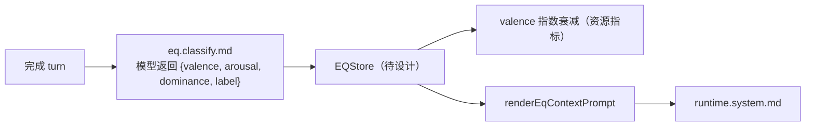

# EQ 模块（提案）

> Status: **done**（含 EQ-01 + EQ-02 + EQ-03）。
>
> - EQ-01 三 slice：协议层 + brain.db 持久化 + `[eq-context]` prompt 注入 + 决策侧 `peekEqState` 公共读 API + 红线审计。
> - EQ-02：决策侧消费 — `EqDirective` 封闭枚举（calm-down / match-energy / steady）+ `deriveEqDirective(state)` 纯函数阈值映射 + `[eq-context]` 块尾结构化 directive 行（`confidence < 0.3` 抑制）。
> - EQ-03：runtime 实际消费 — `runtime.module` 在 ask 强制段调用 `peekEqState + deriveEqDirective`；CalmDown 时把 effective ask cap 临时压为 1（防止对怒/悲用户继续堆问题）；新增 `RuntimeEqDirectiveApplied` 事件审计 + `MemoryAskChainCapped.reason=eq-calm-down`；`tests/eq.runtime.cap.test.ts` 双路径覆盖。
>
> `docs/boundaries.md` 零字符匹配红线全程坚守：`EqLabel` / `EqDirective` 都是封闭枚举，`runtime` 严禁基于消息文本派生；`tests/eq.decision.test.ts` 内含红线审计扫描 src/，对 5 个 label + 2 个非平凡 directive 值禁止 `includes/indexOf/match/test/split` 关键词派生路径。下一步候选见 `TODO.md`「下一阶段候选」表（P2 inbox project 容器收口、blocked 的 LF-R10/R11）。

## 目标

为 Flyflor 提供「情绪状态」的轻量建模能力，让模型在 turn 之间能感知到用户当前情绪基线，并影响：

- 回复语气（保留在 SOUL.md 约束之下）
- skill 选择优先级（不绕过 boundaries 红线，仍走模型结构化字段）
- 是否触发安抚 / 缓冲性消息

## 不做的事

- **不做关键词检测**。情绪分类必须由模型在结构化字段中返回，参考 `feedback.classify.md`。
- 不替代 USER.md 长期偏好；EQ 只是短期状态。
- 不引入新的硬编码语义规则。

## 概念模型



## 数据结构（草稿）

```ts
interface EqState {
    valence: number;        // -1..1
    arousal: number;        // 0..1
    dominance: number;      // 0..1
    label: "neutral" | "joy" | "anger" | "sadness" | "fear" | "surprise";
    confidence: number;
    updatedAt: string;
}
```

## 与边界的关系

- valence 衰减允许走纯资源指标（时间窗 / 计数器）。
- 标签 / 强度变化必须由模型结构化字段产生，禁止文本匹配。
- 数据落点：建议 SQLite 单表 `eq_state`，与 `projectConstraintId` / `turnId` 审计键关联。

## 落地清单（如批准）

1. 加 `eq.classify.md` 模板，约束模型返回 schema。
2. `src/agent/eq/` 模块（继承 `Service` decorator）。
3. `MemoryModule.buildPrompt` 注入 `eqContext`。
4. 决策点（skill 选择 / 回复策略）只读模型结构化字段，不读文本。
5. 测试覆盖：分类 schema、衰减、与 USER.md 偏好不冲突。

## 风险点

- 情绪建模容易引入隐形语义判断（必须严格走结构化字段）。
- 误触发安抚消息会显著破坏体验，需要明确审批通道。
- 与 SOUL.md 的语气约束可能冲突；SOUL.md 优先级更高。
