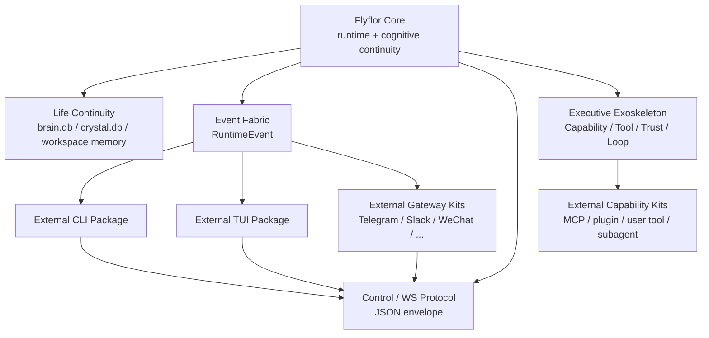

# Refactor Roadmap

## 一句话定位

Flyflor 当前重构目标是把单仓内的 agent app 重塑为 **生命体内核 + 可插拔外骨骼**：内核保留认知连续性、事件协议和运行时协议；执行力通过 Executive 外骨架接入 Herme-agent / OpenClaw 类能力；CLI、TUI、Gateway 渠道实现逐步外部化为独立套件。

本文件是阶段性 plan 的稳定说明；根目录 `TODO.md` 是每轮交接和阶段状态的唯一活跃清单。每完成一个阶段，必须同步更新本文件、相关主文档和 `TODO.md`，并把被替代的旧材料移入 `docs/old-docs/`。

## 重构原则

- **内核只保留生命连续性**：Memory、Crystal、Identity、Ghost、Ask、ContextFork、BehaviorSnapshot、RuntimeEvent 和 Control/WebSocket 协议是稳定轴。
- **外骨骼提供执行力**：Capability / Tool / Trust / Loop 从工具过滤升级为可规划、可观察、可中断、可恢复、可审计的执行循环。
- **交互面外部化**：CLI、TUI、具体 Gateway channel adapter 不再是内核必须内置的身体，只通过 event/control/ws 与内核交互。
- **语义仍由模型结构化输出驱动**：路由、记忆、反馈、意图、复杂度和矛盾检测继续遵守零字符匹配红线。
- **Bun 单文件二进制不退让**：插件、外部套件和执行 bridge 不能引入运行时 `node_modules` 依赖、native addon、postinstall 或动态 require/import。

## 目标形态

## 阶段计划

### R0 计划与文档基线

目标：把“外骨骼重塑内在”的重构目标写成明确阶段计划，避免后续 session 只跟着局部文件漂移。

任务：

- 建立本路线文档并接入 `docs/README.md` 与根 `README.md`。
- 更新 `TODO.md`，记录阶段状态、每阶段收尾协议和验证命令。
- 明确旧文档归档规则：主文档被新实现替代时移入 `docs/old-docs/`，只保留当前契约在 `docs/` 根层。

验收：

- `bun test tests/docs.index.test.ts tests/todo.status.test.ts --timeout 30000`
- `bun run check`

### R1 Core Boundary Freeze

状态：完成。

目标：冻结内核可依赖的最小边界，让 CLI/TUI/Gateway 拆分时不会反向拉扯 runtime。

任务：

- 明确 core 只暴露 RuntimeEvent、control envelope、capability snapshot、turn delta/final、memory continuity API。
- 梳理 `src/app.ts` composition root，把 CLI/TUI/Gateway 直接耦合点标记为待外部化适配层。
- 给 `src/protocol/control` 和 `src/events` 补齐外部 client 需要的契约文档和测试。
- 收紧 control payload：project/fork/skill scope 必须完整结构化传入，core 不接受只传 project id 后再猜测项目目录。

验收：

- `bun test tests/protocol.control.test.ts tests/event.component.test.ts tests/gateway.ws.test.ts --timeout 30000`
- `bun run check`
- 文档更新：`docs/architecture.md`、`docs/runtime.events.md`、`docs/refactor.roadmap.md`、`TODO.md`

### R2 Executive Exoskeleton Upgrade

状态：完成。

目标：把执行层从“工具 catalog + guard”推进到可承载 Herme-agent / OpenClaw 类执行力的外骨骼。

任务：

- 迁移 `src/cttl` 到 `src/executive`，并移除旧 `src/cttl` 物理路径。（已完成）
- 将 registry、planner、guard、loop guard、capability descriptor 和 catalog snapshot 收拢到 Executive 目录。（已完成）
- 为 delegate、computer、code runner、browser、LSP、message、media 等能力族预留 descriptor，不把它们写成固定 prompt 命令清单。（已在文档中保留能力族规则；具体实现进入后续 External Kit / Capability Kit 阶段）
- 明确 long-running task 的中断、恢复、审批和审计协议。（已在本阶段方向中固定，细化实现进入 R5 kit 协议）

验收：

- `bun test tests/cttl.core.test.ts tests/runtime.mcp.tool.plan.test.ts tests/skill.mcp.test.ts --timeout 30000`
- `bun run check`
- `bun run build:binary`
- 文档更新：`docs/cttl.exoskeleton.md`、`docs/sandbox.capabilities.md`、`docs/refactor.roadmap.md`、`TODO.md`

### R3 Cognitive Core Migration

状态：完成。

目标：把迁移期 FCH 目录落到 `src/cognitive`，让 Mindstream / Crystal / Hippocampus 成为公开内核边界。

任务：

- 迁移 `src/fch/mindstream`、`src/fch/crystal`、`src/fch/hippocampus` 到 `src/cognitive`。（已完成）
- 移除旧 `src/fch` 物理路径，不再保留 Cognitive 兼容壳。（已完成）
- 确认 Cognitive 不直接执行 shell、MCP、channel send、browser/computer 等副作用。
- 保持 brain.db、crystal.db、project/fork/ghost/identity/eq 写入协议不漂移。

验收：

- `bun test tests/memory.boundaries.test.ts tests/reflection.boundaries.test.ts tests/llm.factory.test.ts --timeout 30000`
- `bun run check`
- `bun run build:binary`
- 文档更新：`docs/architecture.md`、`docs/memory.system.md`、`docs/crystal.reflection.md`、`docs/directory.architecture.md`、`docs/refactor.roadmap.md`、`TODO.md`

### R4 Agent Shell Split + Executive Tool Runtime

状态：完成。

目标：把当前内置 CLI/TUI/Gateway 从“内核组成部分”降级为“第一方外部套件候选”，内核只保留 event/control/ws 协议。

任务：

- 把 `src/skills` 迁移到 `src/agent/skills`，把 `src/context` 迁移到 `src/agent/context`，并移除旧物理路径。（已完成）
- 把 `src/command` 对 runtime 的直接使用收敛到 control/ws client 或薄本地 adapter。（本地 adapter 已建立；chat TUI 已改为窄 `CommandRuntimeClient`，后续可替换成 control/ws client）
- 梳理 TUI 只读/交互面所需事件，缺口补到 RuntimeEvent 和 control envelope，而不是 import 私有模块。（本地只读状态 adapter 已建立）
- Runtime 工具循环迁移到 Executive：Runtime 只编排 turn，Context owner 装配 model messages，Executive 负责 schema/sandbox/approval/result/loop guard/read-only 并发与写/执行串行调度。（已完成）
- MCP、workspace、git、shell、user tool、plugin capability 通过 `RuntimeMcpToolExecutor` 接入同一 `<flyflor_mcp_calls>` wire 和结果回灌格式。（已完成）
- MCP resources/prompts 读取通过 `RuntimeMcpCapabilityReader` 统一可见性确认、sandbox/approval gating 与受控 transport 调用；Runtime 不直接导入底层 read/get 执行函数。（已完成）
- Gateway 保留最小 control/event transport；`GatewayControlHub` `/ws` 是第一方迁移传输和外部 client 契约，channel adapter 只通过 `StreamingMessageDispatcher` 进入消息调度。（已完成）
- Executive manifest 与 JSONC config boundary 已改为严格校验；sandbox approval callback 异常通过 `approval-error` 事件 payload 可观察。（已完成）
- 文档中把 CLI/TUI/channel 当前内置状态标记为迁移期，不再当核心边界描述；具体 channel adapter 的独立包化、kit manifest 和执行 bridge 进入 R5。

验收：

- `bun test tests/executive.tool.runtime.test.ts tests/runtime.executive.boundaries.test.ts tests/skill.mcp.test.ts tests/runtime.mcp.tool.plan.test.ts tests/mcp.long.results.test.ts tests/mcp.schema.validate.test.ts tests/sandbox.gate.test.ts tests/runtime.toolset.test.ts tests/plugin.runner.test.ts tests/plugin.registry.test.ts --timeout 30000`
- `bun test tests/command.boundaries.test.ts tests/tui.lifecycle.test.ts tests/channels.status.test.ts --timeout 30000`
- `bun run check`
- `bun run build:binary`
- 文档更新：`docs/cli.commands.md`、`docs/gateway.channels.md`、`docs/runtime.events.md`、`docs/refactor.roadmap.md`、`TODO.md`

### R5 External Kit Protocol

状态：进行中。

目标：定义外部套件的安装、发现、权限、事件订阅和执行桥协议。

任务：

- 定义 external kit manifest：CLI/TUI/Gateway/Capability kit 的 source、scope、permissions、commands、events、control messages。（已落 protocol contract、builtin discovery snapshot、global/project JSONC load path 与坏 manifest control error）
- 保持所有 kit 通过 JSONC config / secrets provider / capability descriptor 接入。
- plugin、MCP、skill、user tool、subagent 统一进入 Executive registry；不允许套件绕过 sandbox。
- 制定 old-docs 归档清单，移动被 kit 协议替代的历史文档。

验收：

- `bun test tests/plugin.runner.test.ts tests/skill.schema.compat.test.ts tests/mcp.http.transport.test.ts --timeout 30000`
- `bun run check`
- `bun run build:binary`
- 文档更新：新增或更新 kit 协议文档、`docs/refactor.roadmap.md`、`TODO.md`、`docs/old-docs/README.md`

### R6 Release Gate And Cleanup

目标：在外部化阶段完成后清理迁移残留，保证文档、测试、目录和发布资产一致。

任务：

- 删除或归档过时迁移说明，根层 docs 只保留当前运行契约。
- `docs/old-docs/README.md` 列出所有被替代材料。
- 更新 README、AGENTS、boundaries、directory architecture、TODO 的最终状态。
- 跑完整 deterministic release gate。

验收：

- `bun run docs:check`
- `bun run check`
- `bun run test`
- `bun run build:binary`
- `bun run smoke:agent`

## 每阶段收尾协议

每个阶段完成前必须做四件事：

1. 更新 `TODO.md`：状态、完成内容、下一步、跑过的验证命令。
2. 更新相关主文档：只描述当前契约，不把已经替代的方案留在 docs 根层。
3. 归档旧文档：被替代或只剩历史价值的文档移入 `docs/old-docs/`，并更新 `docs/old-docs/README.md`。
4. 验证：至少跑该阶段列出的测试、`bun run check`；涉及构建或发布路径时跑 `bun run build:binary`。
