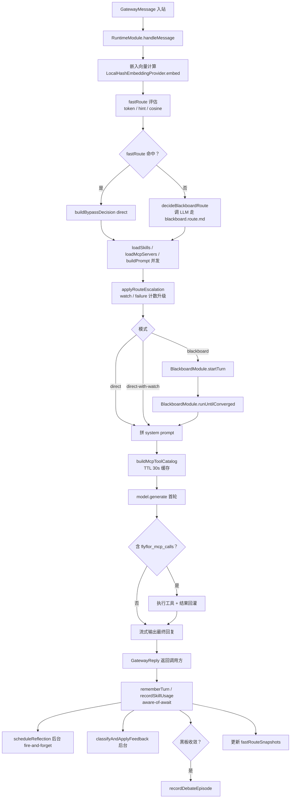
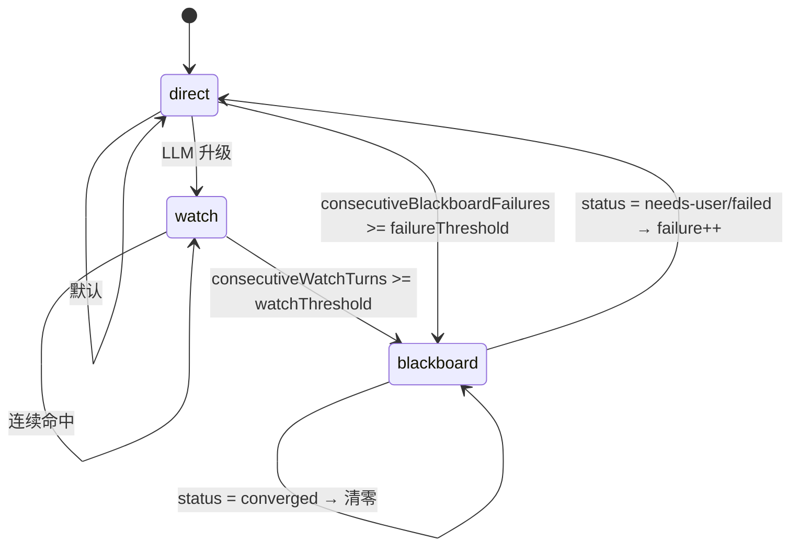
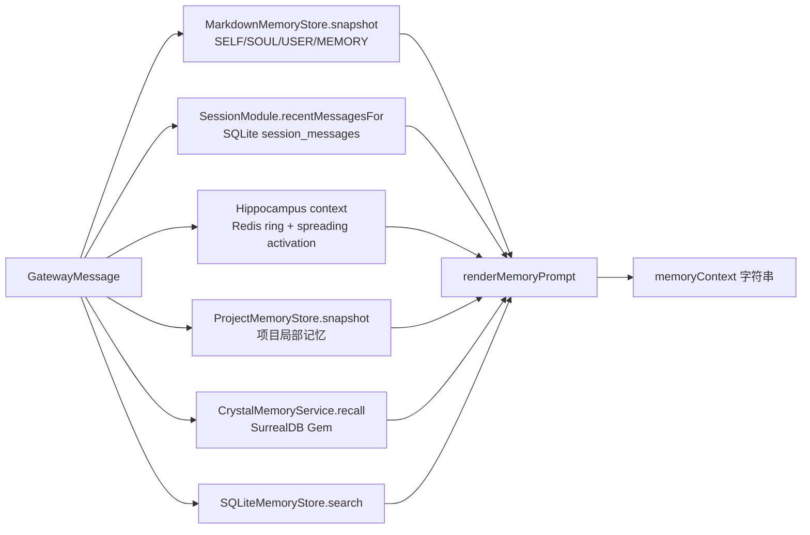
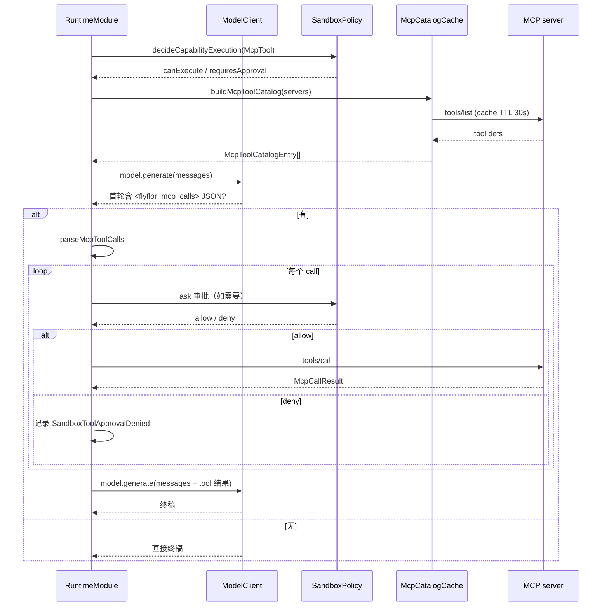
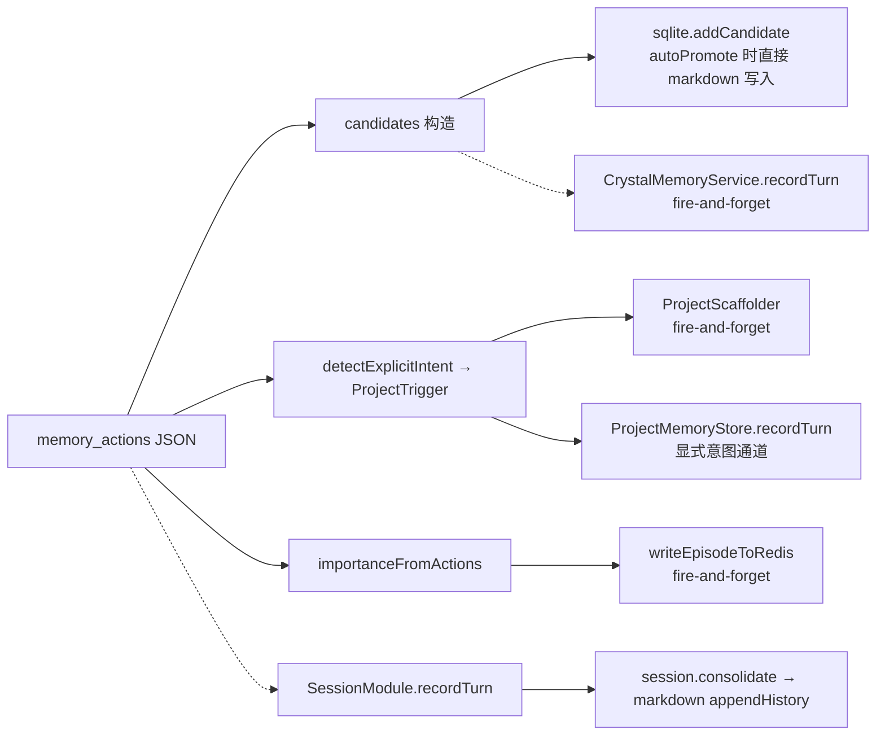

# 单轮请求流程

## 一句话定位

`RuntimeModule.handleMessage` 是热路径唯一入口；从 Gateway 归一化消息到回复落盘、记忆写入、后台反思的全过程都在这里编排。

## 相关代码路径

- `src/agent/runtime/runtime.module.ts` — 热路径主入口
- `src/agent/runtime/fast.route.ts` — 资源指标短路
- `src/agent/runtime/blackboard.route.ts` — LLM 路由模板调用
- `src/agent/runtime/route.escalation.ts` — direct-with-watch 升级器
- `src/agent/runtime/reflection.ts` — 反思候选提取
- `src/agent/runtime/perf.metrics.ts` — 性能事件采集
- `src/agent/runtime/chat.ts` — TTY 交互入口
- `src/neural/memory/index.ts` — `MemoryModule.buildPrompt` / `rememberTurn`
- `src/agent/mcp/tool.calls.ts` — `<flyflor_mcp_calls>` 解析

## 核心阶段



## fastRoute（资源指标短路）

只允许三类指标，未命中才调路由 LLM：

| 指标 | 命中条件 | 阈值 |
| --- | --- | --- |
| token 预算 | `estimatedTokens < routeBypassTokenBudget` | 配置 |
| hint 复用 | `nextRouteHint === direct` 且 `now - recordedAt < routeHintTtlMs` | 配置 |
| embedding 相似 | `lastMode === direct` 且 `cosine > similarityBypassThreshold` | 配置 |

落库的 `FastRouteSnapshot`（按 `channel:chatId:userId` 维度）会在 turn 末尾更新：

```ts
interface FastRouteSnapshot {
    recordedAt: number;
    embedding?: number[];
    lastMode: BlackboardMode;
    nextRouteHint?: BlackboardMode;
    consecutiveWatchTurns?: number;
    consecutiveBlackboardFailures?: number;
}
```

## Blackboard route（LLM 决策）

`templates/prompts/blackboard.route.md` 必须返回结构化 JSON：

```json
{
  "mode": "direct | direct-with-watch | blackboard",
  "score": 0.0,
  "reason": "...",
  "signals": ["..."],
  "needsReflectionCandidate": true,
  "blackboardContract": { "evidence": [], "contradictions": [], "mode": "normal" },
  "workers": [{ "role": "...", "stage": "...", "handoff": "...", "capabilities": [], "dependsOn": [] }]
}
```

代码只做 `mode` 枚举校验、`score` 数值范围、`workers` 数量 `<= 5`，不二次解析自然语言。

## 路由升级



阈值来自 `RoutingConfig`：`watchEscalationThreshold`（默认 3）、`blackboardFailureEscalationThreshold`（默认 2）。任一为 0 表示禁用该通道。

## 上下文装配（`MemoryModule.buildPrompt`）



输出后用 `renderRuntimeSystemPrompt` 拼接，注入：

- `sandboxSummary`：当前 sandbox 模式描述
- `memoryContext`：上面的合成 prompt
- `memoryActionInstructions`：`memory.action.md`
- `skillContext`：`renderSkillContextPrompt`
- `mcpContext`：`renderMcpContextPrompt`（含可用工具 catalog）
- `blackboardContext`：`renderBlackboardAdvisoryPrompt`

## MCP 工具循环



## 记忆写回（`rememberTurn`）

并行三条管道，全部完成后才结束 `rememberTurn`：



随后 fire-and-forget 启动：

- `scheduleReflection` — LLM 抽取 symbols/bucket/coordinates → `MemoryModule.applyReflection` → Crystal 候选
- `classifyAndApplyFeedback` — A/B/C/D 分类（结构已就位，写入路径未完整打通）
- 收敛黑板 → `recordDebateEpisode` 高权重 episode

## 性能事件

| 事件 | 含义 |
| --- | --- |
| `perf.ttfb` | 首字延迟（目标 < 350ms） |
| `perf.build_prompt` | 上下文装配耗时 |
| `perf.route_llm` | 路由阶段总耗时（含 bypass） |
| `perf.fast_route_evaluated` | fastRoute 决策记录 |
| `perf.redis_latency` | Redis warmup ping |
| `perf.surreal_ann_latency` | SurrealDB ANN 检索耗时 |

## 关键数据结构

```ts
interface RuntimeContext {
    requestId: string;
    now: string;            // ISO timestamp
    embedding?: number[];   // 由 handleMessage 计算并下发
    skillNames?: string[];  // CLI --skills 透传
    // ...
}

interface GatewayReply {
    messageId: string;
    route: GatewayRoute;
    text: string;
    metadata: {
        blackboard?: { turnId, mode, status, elapsedMs, ... };
        memoryActions: number;
        mcpToolCalls: number;
        mcpToolExecutions: Array<{ server, tool, ok, ... }>;
        skills: string[];
        sandboxMode: SandboxMode;
        // ...
    };
}
```

## 配置与约束

- `config.routing.fastRouteEnabled` 控制资源短路总开关。
- `config.routing.routeHintTtlMs` / `similarityBypassThreshold` / `routeBypassTokenBudget` 控制短路命中阈值。
- `config.memory.embedding.dimensions` 决定 embedding 向量长度；`LocalHashEmbeddingProvider` 不联网。
- `config.metrics.enabled` 关闭时所有 perf 事件不发布。

## 风险点 / 已知缺口

- `handleMessage` 文件约 1300 行，热路径逻辑高度集中，未来需要按「路由 / 装配 / 工具循环 / 记忆写回」拆出独立 service。
- direct-with-watch 升级器只计数，**未引入「工具反复失败 / context pressure」语义信号**。
- `classifyAndApplyFeedback` 分类已落实，**写入 episode / preference / 宪法 / skill 的四条通道未全部打通**。
- `MemoryModule` 由 `RuntimeModule` 内部构造，外部无法注入替代实现。
- `fastRouteSnapshots` 是进程内 Map，**重启即丢失**；多 gateway 节点不共享。

## 相关测试

- `tests/runtime.perf.test.ts`
- `tests/route.escalation.test.ts`
- `tests/chat.boundaries.test.ts`
- `tests/feedback.wire.test.ts`
- `tests/memory.scheduler.wiring.test.ts`
