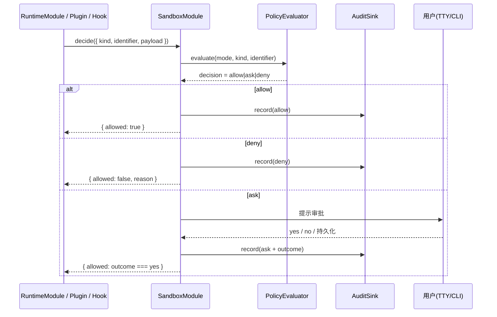

# Sandbox 与能力控制

## 一句话定位

Sandbox 为三类可观察操作（MCP 工具、Plugin、Shell hook）提供 `deny / ask / allow` 三态决策；YOLO 全开模式只对人类用户可见，自动化流程默认走严格模式。

## 相关代码路径

- `src/agent/sandbox/sandbox.module.ts` — 决策核心
- `src/agent/sandbox/policy.ts` — 默认策略
- `src/agent/sandbox/audit.ts` — 审计 sink
- `src/protocol/contracts/enums.ts` — `SandboxMode` / `SandboxCapabilityKind`
- `src/agent/mcp/tool.calls.ts` — MCP 调用接入点
- `src/agent/plugins/*` — Plugin 执行入口
- `src/agent/runtime/runtime.module.ts` — `decideCapabilityExecution` 使用点

## 能力枚举

| `SandboxCapabilityKind` | 来源 | 说明 |
| --- | --- | --- |
| `mcp-tool` | RuntimeModule 调 MCP 工具 | catalog 中每个 tool 走一次决策 |
| `plugin` | Plugin runtime | 子进程 / 二进制启动 |
| `shell-hook` | 模板渲染 / git hook 安装 | 命令行执行 |

## 决策矩阵

| `SandboxMode` | mcp-tool | plugin | shell-hook |
| --- | --- | --- | --- |
| `strict` | ask（高敏感 deny） | ask | deny |
| `interactive` | ask | ask | ask |
| `allowlist` | 名单内 allow，其他 ask | 同 | 同 |
| `yolo` | allow | allow | allow |

> `allowlist` 由配置定义：`config.sandbox.allowList.tools[]` / `plugins[]` / `shellHooks[]`。

## 决策时序



非交互场景（gateway 后台、batch）下 `ask` 自动降级为 `deny`，并写审计 `auto-denied`。

## 数据结构

```ts
interface SandboxDecisionRequest {
    kind: SandboxCapabilityKind;
    identifier: string;     // tool name / plugin id / hook id
    summary?: string;       // 给人看的一句话
    payload?: unknown;      // 上下文（不入 prompt）
}

interface SandboxDecisionResult {
    allowed: boolean;
    decision: "allow" | "ask" | "deny";
    reason?: string;
    persisted?: boolean;    // 是否记入 allowlist
}
```

## 审计

每条决策落到 `config.sandbox.auditPath`（默认 `~/.flyflor/sandbox-audit.jsonl`）：

```json
{ "ts": "...", "kind": "mcp-tool", "identifier": "filesystem.read",
  "decision": "allow", "mode": "interactive", "requestId": "...", "user": "..." }
```

## 配置

- `config.sandbox.mode` — 全局默认模式（strict / interactive / allowlist / yolo）
- `config.sandbox.allowList` — 三类 capability 各自的允许列表
- `config.sandbox.askPromptFormat` — TTY 审批提示模板
- `config.sandbox.auditPath` — 审计落盘路径
- `config.sandbox.escalation.timeout` — 提问超时（超时按 deny）

## 事件清单

| 事件 | 触发点 |
| --- | --- |
| `sandbox.decision.evaluated` | 每次 decide |
| `sandbox.tool.approval.requested` | mcp-tool ask 弹窗 |
| `sandbox.tool.approval.denied` | mcp-tool 拒绝 |
| `sandbox.plugin.blocked` | plugin deny |
| `sandbox.shell.blocked` | shell-hook deny |
| `sandbox.audit.written` | 审计落盘 |

## 风险点 / 已知缺口

- Plugin runtime 与 Shell hook 执行链未**全部**经过 SandboxModule（部分早期入口直连）。
- `allowlist` 持久化形式仍写在主 config，缺独立的 `~/.flyflor/sandbox.allow.jsonc`。
- 没有「逐次仅允许 N 次」的 quota 机制；只能 once / persistent。
- 审计 sink 不可插拔，无法转发到外部 SIEM。
- `yolo` 模式没有冷却或时间窗保护（一旦开启即长期生效）。

## 相关测试

- `tests/sandbox.boundaries.test.ts`
- `tests/sandbox.tools.test.ts`
- `tests/chat.boundaries.test.ts`
