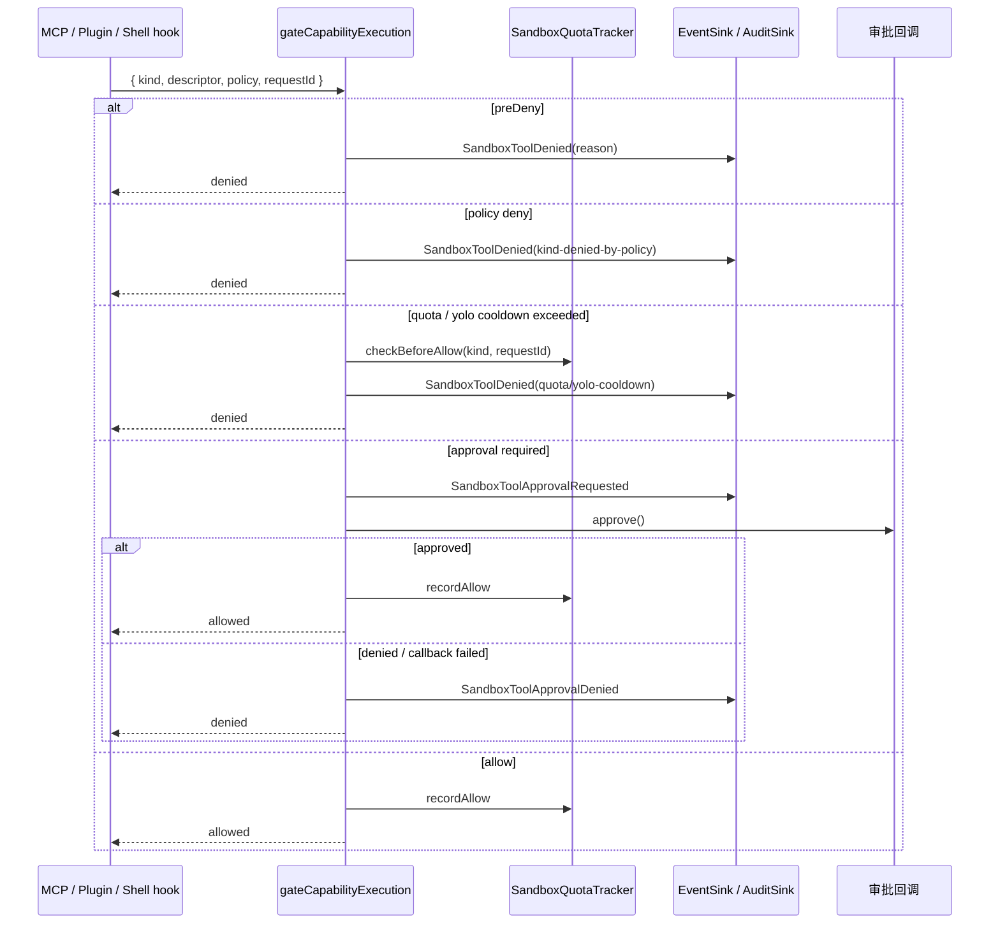

# Sandbox 与能力控制

## 一句话定位

Sandbox 是 MCP 工具、电脑控制、Plugin、Shell hook 四类可执行能力的统一闸门：全局模式只负责默认姿态，具体能力用 `allow / ask / deny` 显式配置；所有执行点都走 `gateCapabilityExecution`，并接入 quota、YOLO 冷却、allowlist 与审计 sink。

## 相关代码路径

- `src/agent/sandbox/module.ts` — `SandboxModule`、策略解析与统一 capability gate
- `src/agent/sandbox/allowlist.store.ts` — 项目 / 全局 `sandbox.allow.jsonc`
- `src/agent/sandbox/quota.ts` — 单请求 quota 与 YOLO 冷却
- `src/agent/sandbox/audit.sink.ts` — file / http 审计 sink
- `src/protocol/contracts/enums.ts` — `SandboxMode` / `CapabilityExecutionKind` / `ToolApprovalMode`
- `src/agent/mcp/tool.calls.ts` — MCP 调用接入点
- `src/agent/plugin/registry.ts` — Plugin manifest 声明、启停和 project/global 覆盖
- `src/agent/plugin/runner.ts` — Plugin 子进程执行入口，启动前必须走 sandbox gate
- `src/agent/runtime/module.ts` — MCP tool gate 与 request quota 清理

## 能力枚举

| `CapabilityExecutionKind` | 来源 | 说明 |
| --- | --- | --- |
| `computer` | Executive computer-control capability | 所有电脑控制能力的统一审批面 |
| `mcp-tool` | RuntimeModule 调 MCP 工具 | catalog 中每个 tool 调用前走一次 gate |
| `plugin` | Plugin runner | 插件命令 / 二进制启动前走 gate |
| `shell-hook` | Shell hook executor | hook 命令执行前走 gate |

## 决策模型

| 配置 | 取值 | 说明 |
| --- | --- | --- |
| `config.sandbox.mode` | `off` / `yolo` | `off` 默认 deny；`yolo` 默认 allow |
| `config.sandbox.computerApproval` | `allow` / `ask` / `deny` | 覆盖 computer capability 的默认决策 |
| `config.sandbox.mcpToolApproval` | `allow` / `ask` / `deny` | 覆盖 MCP tool 的默认决策 |
| `config.sandbox.pluginApproval` | `allow` / `ask` / `deny` | 覆盖 plugin 的默认决策 |
| `config.sandbox.shellHookApproval` | `allow` / `ask` / `deny` | 覆盖 shell hook 的默认决策 |

`SandboxModule.policy()` 会把 mode 与四个 per-capability approval 归一成 `SandboxPolicy.approvals`。默认值在 `src/config/index.ts` 中固定为 `mode=off` 且四类能力均 `deny`；用户显式改为 `yolo` 时，未单独覆盖的能力才默认 `allow`。

交互式本地调试时，`./dist/flyflor` / `flyflor chat` 只对本次进程把 `shellHookApproval` 覆盖为 `ask`，模型能看见内置 `shell.run`，但每次执行仍需终端确认；`--accept-hooks` 则覆盖为 `allow`，用于本地已信任的快速调试。Runtime 会把内置 `shell.run` 暴露进 MCP 结构化工具目录，但实际执行仍经过 `ShellHookExecutor`、sandbox gate、超时和输出截断。

## 决策时序



非交互场景下调用方不传 `approve`，`ask` 会按未批准处理并发布 approval denied 事件；这让 gateway、batch、后台任务默认失败关闭。

## 数据结构

```ts
interface SandboxPolicy {
    mode: "off" | "yolo";
    approvals: Record<"computer" | "mcp-tool" | "plugin" | "shell-hook", "allow" | "ask" | "deny">;
    computerApproval: "allow" | "ask" | "deny";
    mcpToolApproval: "allow" | "ask" | "deny";
    pluginApproval: "allow" | "ask" | "deny";
    shellHookApproval: "allow" | "ask" | "deny";
    canExecuteTools: boolean;
    requiresApproval: boolean;
    summary: string;
}

interface CapabilityGateInput {
    policy: SandboxPolicy;
    kind: "computer" | "mcp-tool" | "plugin" | "shell-hook";
    descriptor: Record<string, unknown>;
    preDeny?: { reason: string; message: string };
    approve?: () => boolean | Promise<boolean>;
    quota?: SandboxQuotaTracker;
}
```

## Allowlist

`sandbox.allow.jsonc` 与主配置解耦，记录用户运行时显式允许的可执行项：

```jsonc
{
    "pluginCommands": ["bun"],
    "shellCommands": ["git"],
    "mcpTools": ["filesystem.read"]
}
```

- 全局文件：`~/.flyflor/sandbox.allow.jsonc`
- 项目文件：`<project>/.flyflor/sandbox.allow.jsonc`
- 合并规则：项目层与全局层取并集，严格精确等值匹配，不做关键词或语义判断
- CLI：`flyflor sandbox list/allow/deny`

Plugin registry 只管理 JSONC manifest，不直接执行 entry；`PluginRunner` 负责 spawn，并在执行前用 `CapabilityExecutionKind.Plugin`、命令白名单和 allowlist 做统一 gate。这样 registry、CLI 和项目配置无法绕过 sandbox 直接启动外部进程。

## Quota 与 YOLO 冷却

`SandboxQuotaTracker` 是进程内请求级保护：

- `config.sandbox.quota.perKindPerRequest`：同一个 `requestId` 下每种 capability 最多放行 N 次；超出发布 `quota-exceeded`
- `config.sandbox.quota.yoloCooldownMs`：YOLO 自动放行的同类 capability 最小间隔；冷却未到发布 `yolo-cooldown`
- `RuntimeModule` 在请求结束后调用 `forgetRequest(requestId)` 释放计数器

## 审计

默认未配置时装配 file sink，写入 `<logDir>/audit.jsonl`；也可以配置多个 sink fan-out：

```jsonc
{
    "sandbox": {
        "auditSinks": [
            { "kind": "file", "path": "~/.flyflor/.config/logs/audit.jsonl" },
            { "kind": "http", "url": "https://siem.example.com/ingest", "timeoutMs": 3000 }
        ]
    }
}
```

`FileAuditSink` 与 `HttpAuditSink` 只持久化 `AUDITED_EVENTS` 白名单内的关键事件，追加写失败会暴露到 `flush()` / 调用链，不静默吞审计错误。

## 事件清单

| 事件 | 触发点 |
| --- | --- |
| `sandbox.tool.approval.requested` | capability 需要审批 |
| `sandbox.tool.approval.denied` | 审批拒绝、审批回调失败或非交互 ask |
| `sandbox.tool.denied` | policy / preDeny / quota / YOLO 冷却拒绝 |
| `sandbox.shell_hook.start/end/failed` | shell hook 子进程生命周期 |
| `plugin.invoke.start/end/failed` | plugin runner 生命周期 |
| `mcp.tool.call.executed` | MCP tool 实际执行 |

## 运行边界

- Sandbox 只判断执行权限，不判断业务语义；业务意图、路由、记忆动作仍只能来自模型结构化输出或专用提示词 JSON。
- `ask` 是否弹出交互 UI 由调用方提供审批回调决定；后台入口不提供回调时按失败关闭。
- 电脑控制必须走独立 `computerApproval` 面；不能再混用普通 `mcpToolApproval`。
- allowlist 是可执行项的精确等值名单，不是安全沙箱本体；真正的文件 / 网络 / 进程隔离仍由宿主环境与具体 runner 负责。
- quota 是进程内保护；多副本部署需要每个副本各自维护，或在未来引入共享 quota store。

## 相关测试

- `tests/sandbox.allowlist.test.ts`
- `tests/sandbox.audit.test.ts`
- `tests/sandbox.gate.test.ts`
- `tests/sandbox.quota.test.ts`
- `tests/shell.hook.executor.test.ts`
- `tests/plugin.runner.test.ts`
- `tests/skill.mcp.test.ts`
