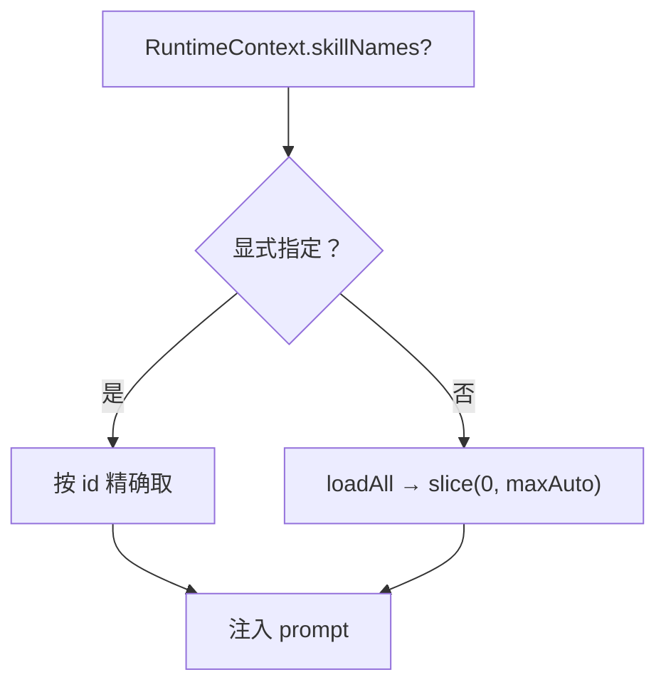

# Skill 系统

## 一句话定位

Skill 是可重用、可热加载的「做事方式」工件：manifest.json 描述能力，loader 把 markdown 拼进 prompt，usage 计数推动 promotion。

## 相关代码路径

- `src/crystal/skills/index.ts` — SkillLoader / 选择 / usage / promotion
- `src/agent/prompts/index.ts` — `renderSkillContextPrompt`
- `templates/skills/*` — 内置默认 skill 模板
- `~/.flyflor/skills/` — 用户 skill 安装目录

## 数据结构

```ts
interface SkillManifest {
    id: string;
    name: string;
    description: string;
    triggers?: string[];          // 仅做模型 prompt 提示，不做关键词匹配
    capabilities?: string[];
    files?: { system?: string; user?: string; examples?: string[] };
    version?: string;
    author?: string;
}
```

## 安装与加载

```mermaid
flowchart LR
    Builtin["templates/skills/<id>/"] --> Install["scripts/install.skills.ts"]
    Install --> Userdir["~/.flyflor/skills/<id>/"]
    Userdir --> Loader["SkillLoader.scan"]
    Loader --> Memo["skills: SkillManifest[]"]
    Memo --> Select["selectSkillsForTurn"]
    Select --> Prompt["renderSkillContextPrompt"]
    Prompt --> Model["拼入 system prompt"]
```



## 选择策略（当前实现）



> 当前没有 embedding / usage 排序；命中范围由 `RuntimeContext.skillNames`（CLI `--skills`）或默认前 N 决定。

## 使用计数

`recordSkillUsage` 在每轮结束时写入：

```ts
interface SkillUsage {
    skillId: string;
    invokedAt: string;
    turnId?: string;
    outcome: "used" | "skipped";
}
```

落到 SQLite `skill_usage` 表；后续 promotion / 选择排序所需的数据已经在采集。

## Promotion（待落地）

`crystal/skills` 已留出接口：

- 候选来源：reflection 抽出的复用模式
- 触发：cluster size + confidence 双门
- 输出：在 `~/.flyflor/skills/<id>/` 写 `manifest.json` + `system.md`

完整闭环（cluster → LLM 写作 → 用户确认 → 安装）当前未跑通。

## 配置

- `config.skills.enabled`
- `config.skills.userDir` — 默认 `~/.flyflor/skills`
- `config.skills.maxAutoSelect` — slice 上限
- `config.skills.allowExplicitOnly` — true 时只走显式名称

## 事件清单

| 事件 | 触发点 |
| --- | --- |
| `skill.loaded` | scan 完成 |
| `skill.context.built` | renderSkillContextPrompt |
| `skill.usage.recorded` | recordSkillUsage |
| `skill.promoted` | promotion 完成（未落） |

## 风险点 / 已知缺口

- 选择仍是 `slice(0, maxAuto)`，**未按 embedding 相似度 / usage 频次排序**。
- promotion 路径未跑通：cluster → LLM 询问 → 安装 → 反向回填 manifest。
- skill 模板缺少版本兼容声明（runtime 升级后旧模板失败处理弱）。
- usage 计数未被任何决策环节消费。

## 相关测试

- `tests/skill.loader.test.ts`
- `tests/skill.usage.test.ts`
- `tests/skill.context.test.ts`
