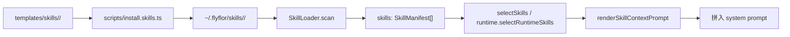
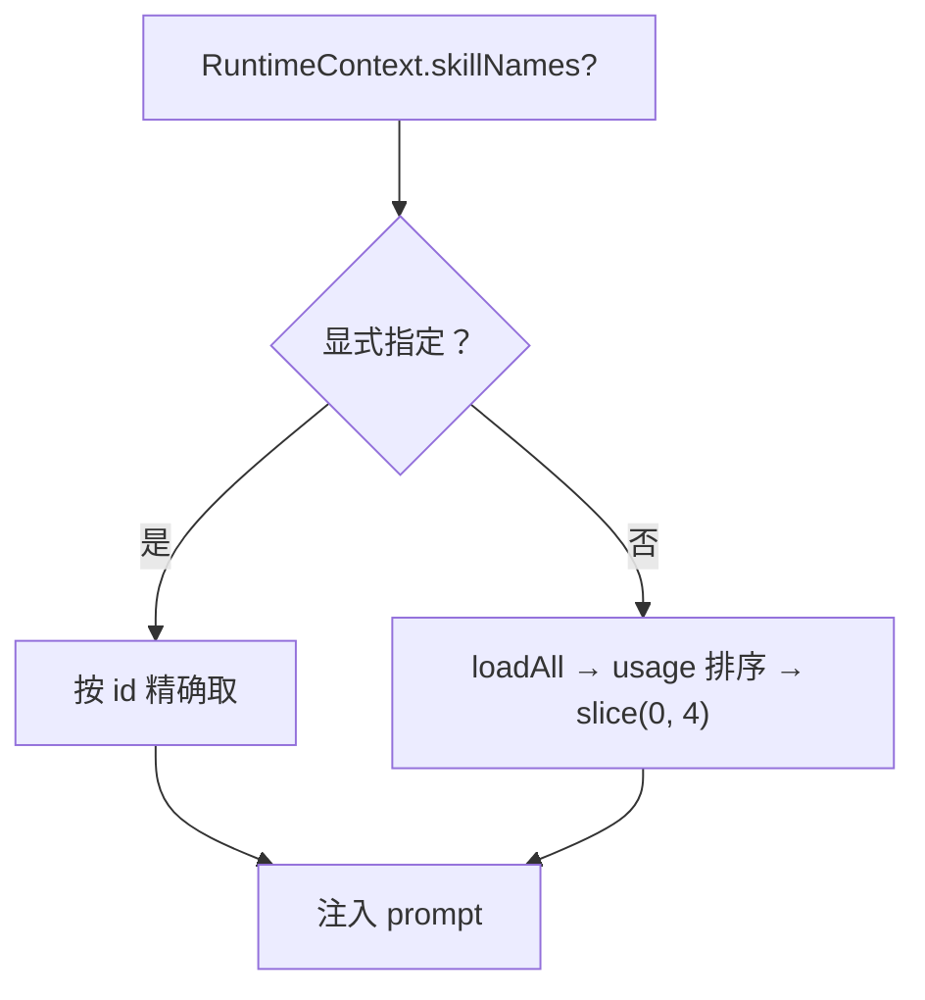

# Skill 系统

## 一句话定位

Skill 是可重用、可热加载的「做事方式」工件：manifest.json 描述能力，loader 把 markdown 拼进 prompt，usage 统计会影响自动选择，promotion 已接到 pending skill offer 的物化闭环。

## 相关代码路径

- `src/crystal/skills/index.ts` — SkillLoader / 选择 / usage / promotion
- `src/agent/prompts/index.ts` — `renderSkillContextPrompt`
- `templates/skills/*` — 内置默认 skill 模板
- `~/.flyflor/skills/` — 用户 skill 安装目录

## 数据结构

```ts
interface SkillManifest {
    id: string;
    name: string;
    description: string;
    triggers?: string[];          // 仅做模型 prompt 提示，不做关键词匹配
    capabilities?: string[];
    files?: { system?: string; user?: string; examples?: string[] };
    version?: string;
    author?: string;
}
```

## 安装与加载



## 选择策略（当前实现）



- 显式命中的技能优先，其余自动池按 `skill_usage.summary.json` 排序。
- 排序信号是 `useCount`、最近使用时间、MCP 成功率，以及 runtime 入口统一计算的一次性查询 embedding；`activation.auto=false` 的技能不进自动池。

## 使用计数

`recordSkillUsage` 在每轮结束时写入：

```ts
interface SkillUsage {
    skillId: string;
    invokedAt: string;
    turnId?: string;
    outcome: "used" | "skipped";
}
```

落到 SQLite `skill_usage` 表，并汇总到 `skill.usage.summary.json`；后续选择排序和 promotion 已会消费这些数据。

## Promotion（已落地）

`pending_skill_offer` + `MemoryModule.consumeSkillOffer` 已把 promotion 闭环跑通：

- 候选来源：reflection 聚合 / explicit skill intent / 现有 skill offer 计时器。
- 触发：cluster support + confidence，或显式 `skillPromotionIntent`。
- 输出：在 `~/.flyflor/skills/<name>/` 写 `SKILL.md` + `skill.json`，并补 `RETROSPECTIVE.md` 的 `skill-promoted` 记录；回顾日志写失败会让 promotion 显式失败，避免技能证据链静默缺块。

- 过期路径：`noteSkillOfferTurn` 会递减 ttl，确认不了就自动过期。

## 配置

- `config.skills.enabled`
- `config.skills.userDir` — 默认 `~/.flyflor/skills`
- `config.skills.maxAutoSelect` — slice 上限
- `config.skills.allowExplicitOnly` — true 时只走显式名称

## 事件清单

| 事件 | 触发点 |
| --- | --- |
| `skill.loaded` | scan 完成 |
| `skill.context.built` | renderSkillContextPrompt |
| `skill.usage.recorded` | recordSkillUsage |
| `memory.skill.offer.proposed` | 生成 pending skill offer |
| `memory.skill.offer.consumed` | `consumeSkillOffer` 物化 SKILL.md |
| `memory.skill.offer.expired` | ttl 归零过期 |
| `memory.skill.installed` | skill 包安装完成 |
| `memory.skill.install.failed` | 安装失败 |

## 运行边界 / 后续增强

- 自动选择已经接入一次性查询 embedding 的轻量语义召回，但仍以 `skill_usage.summary.json` 的 usage / recency / MCP 成功率为主。
- promotion 主要消费显式意图和 cluster 证据，尚未做更细粒度的人机协同确认流。
- skill 模板已有 schema 兼容检查；安装包内容漂移必须由 `validate` / `doctor` 明示报错。

## 相关测试

- `tests/skill.mcp.test.ts`
- `tests/skill.offer.test.ts`
- `tests/skill.schema.compat.test.ts`
- `tests/skill.select.test.ts`
