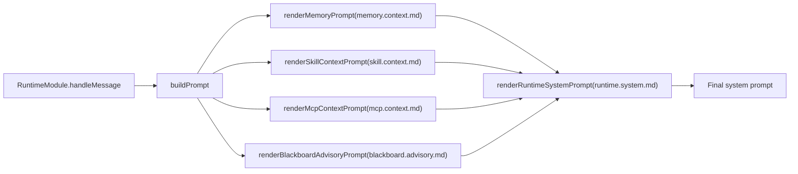
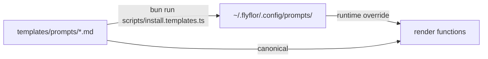

# Prompt Template System

## One-line Summary

All model-facing instructions live in `templates/prompts/`, grouped by topic; canonical `*.md` files are the runtime templates.

## Related Paths

- `src/agent/prompts/index.ts` - all render entry points
- `src/agent/prompts/template.manifest.ts` - template bundle version and file contract
- `src/agent/prompts/template.docs.ts` - docs renderer
- `templates/prompts/` - built-in runtime templates
- `templates/prompts/docs/` - docs renderer templates, not runtime prompts
- `scripts/install.templates.ts` - install into the config directory
- `~/.flyflor/.config/prompts/` - user override directory

## Bundle Version

{{bundleVersion}}

## Template Catalog

| Key | File | Call Site | Required Placeholders |
|---|---|---|---|
| `askSchema` | `ask.schema.md` | `renderAskSchemaInstructions` | — |
| `behaviorPriority` | `behavior.priority.md` | `renderBehaviorPriorityInstructions` | — |
| `blackboardAdvisory` | `blackboard.advisory.md` | `renderBlackboardAdvisoryPrompt` | `compactRounds` / `elapsedMs` / `reason` / `status` / `turnId` |
| `blackboardDecision` | `blackboard.decision.md` | `BlackboardModule.returnDecisionToUser` | `questionCount` / `reason` / `unresolvedIssues` |
| `blackboardRoute` | `blackboard.route.md` | `decideBlackboardRoute` | `request` |
| `blackboardWorkerEnvelope` | `blackboard.worker.envelope.md` | `renderBlackboardWorkerEnvelope` | `contractJson` / `convergencePolicyJson` / `currentRoundStepsJson` / `discussionPlanJson` / `goalJson` / `minRoundsJson` / `participantJson` / `phaseJson` / `previousStepsJson` / `roundJson` |
| `blackboardWorkerSystem` | `blackboard.worker.system.md` | `renderBlackboardWorkerSystemPrompt` | `participant` |
| `crystalReflection` | `crystal.reflection.md` | `ReflectionWorker.dispatch` | `evidence` |
| `feedbackClassify` | `feedback.classify.md` | `classifyAndApplyFeedback` | `currentUserText` / `previousAssistantText` |
| `memoryAction` | `memory.action.md` | `renderMemoryActionInstructions` | — |
| `memoryConsolidation` | `memory.consolidation.md` | `ConsolidationWorker` | `episode` |
| `memoryHotCompress` | `memory.hot.compress.md` | `HotMemoryCompressionWorker` | `episodes` |
| `memoryContext` | `memory.context.md` | `renderMemoryPrompt` | `hippocampus` / `markdownContent` / `retrievedResults` / `scopeMemory` |
| `memoryDream` | `memory.dream.md` | `DreamWorker` | `candidates` / `ownerKey` |
| `memoryScopeOffer` | `memory.scope.offer.md` | `renderScopeOfferPrompt` | `evidenceScore` / `relatedCount` / `remainingTurns` / `title` |
| `memorySkillOffer` | `memory.skill.offer.md` | `renderSkillOfferPrompt` | `confidence` / `name` / `remainingTurns` / `support` / `tools` |
| `mcpContext` | `mcp.context.md` | `renderMcpContextPrompt` | `mcpEntries` |
| `mcpToolBudgetExhausted` | `mcp.tool.budget.exhausted.md` | `renderMcpToolBudgetExhaustedPrompt` | — |
| `runtimeAskContinuation` | `runtime.ask.continuation.md` | `renderRuntimeAskContinuationPrompt` | `chainDepth` / `choices` / `prompt` / `reason` |
| `runtimeIdleResume` | `runtime.idle.resume.md` | `renderRuntimeIdleResumePrompt` | `idleBucket` |
| `runtimeEqContext` | `runtime.eq.context.md` | `renderRuntimeEqContextPrompt` | `ageBucket` / `arousal` / `confidence` / `directive` / `dominance` / `label` / `valence` |
| `runtimeContinuationHint` | `runtime.continuation.hint.md` | `renderRuntimeContinuationHintPrompt` | `continuationEntries` |
| `runtimeIdentityContext` | `runtime.identity.context.md` | `renderRuntimeIdentityContextPrompt` | `identityEntries` |
| `runtimeSystem` | `runtime.system.md` | `renderRuntimeSystemPrompt` | `askSchemaInstructions` / `behaviorPriorityInstructions` / `blackboardContext` / `mcpContext` / `memoryActionInstructions` / `memoryContext` / `sandboxSummary` / `skillContext` |
| `skillContext` | `skill.context.md` | `renderSkillContextPrompt` | `skillEntries` |

## Assembly Flow

## Install Flow

- A same-named file in the user directory overrides the built-in template; the install script syncs the bundle and manifest together.
- Runtime only loads canonical `.md` template files.
- `*.zh.cn.md` files are audit-only mirrors synced by the install script; they do not enter the runtime bundle, manifest, or lint contract.
- `templates/prompts/docs/*.md` files are docs-renderer templates; they are not installed as runtime prompts.

## Data Contract

Every template must guarantee:

1. The model emits structured JSON sections by schema while code only validates shape, enums, and ranges.
2. Template-facing enum values come from `src/protocol/contracts/enums.ts`; add new enums there before updating templates.
3. Templates must not allow the model to invent undeclared fields; extra fields are always discarded.

## Prompt-facing Enums

{{promptFacingEnums}}

## Model Readability

Runtime-injected templates should only contain instructions the model can act on directly: when to use them, what structure to emit, what each field means, and how to resolve conflicts. Internal route ids, TODO ids, phase names, and implementation metaphors must not appear in runtime prompts.

Internal identifiers may stay in archived planning docs, design docs, code comments, and test names; model-facing templates must translate them into plain source labels and behavior descriptions.

## Release Checks

- Template lint checks required files, non-empty content, required placeholders, unknown prompt files, the bundle manifest version, and the template catalog.
- Runtime prompt bodies must not expose internal route ids or unexplained engineering metaphors.
- `*.zh.cn.md` mirrors do not participate in runtime assembly or manifest comparison; they are for human review and audit only.
- `template.docs.ts` reads this Markdown template and only replaces machine values such as bundle version and enum snapshots.
- Runtime only assembles canonical `.md` files.

## Related Tests

- `tests/prompt.lint.test.ts`
- `tests/prompt.templates.docs.test.ts`
- `tests/blackboard.boundaries.test.ts`
- `tests/eq.prompt.test.ts`
- `tests/ask.parse.test.ts`
