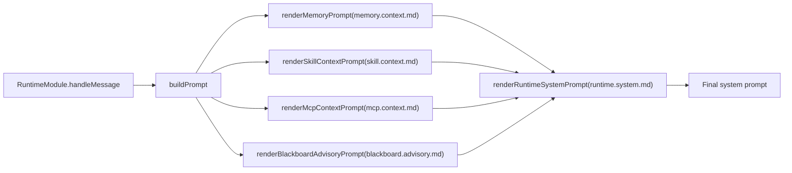
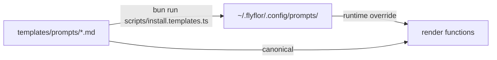

# 提示词模板系统

## 一句话摘要

所有面向模型的指令都放在 `templates/prompts/`，按主题分组；运行时只把 canonical `*.md` 当作模板。

## 相关路径

- `src/agent/prompts/index.ts` - 所有渲染入口
- `src/agent/prompts/template.manifest.ts` - 模板包版本与文件契约
- `src/agent/prompts/template.docs.ts` - 文档渲染器
- `templates/prompts/` - 内置运行时模板
- `templates/prompts/docs/` - 文档渲染模板，不是运行时 prompt
- `scripts/install.templates.ts` - 安装到配置目录
- `~/.flyflor/.config/prompts/` - 用户覆盖目录

## 模板包版本

{{bundleVersion}}

## 模板目录

| 键 | 文件 | 调用点 | 必需占位符 |
|---|---|---|---|
| `askSchema` | `ask.schema.md` | `renderAskSchemaInstructions` | — |
| `behaviorPriority` | `behavior.priority.md` | `renderBehaviorPriorityInstructions` | — |
| `blackboardAdvisory` | `blackboard.advisory.md` | `renderBlackboardAdvisoryPrompt` | `compactRounds` / `elapsedMs` / `reason` / `status` / `turnId` |
| `blackboardDecision` | `blackboard.decision.md` | `BlackboardModule.returnDecisionToUser` | `questionCount` / `reason` / `unresolvedIssues` |
| `blackboardRoute` | `blackboard.route.md` | `decideBlackboardRoute` | `request` |
| `blackboardWorkerEnvelope` | `blackboard.worker.envelope.md` | `renderBlackboardWorkerEnvelope` | `contractJson` / `convergencePolicyJson` / `currentRoundStepsJson` / `discussionPlanJson` / `goalJson` / `minRoundsJson` / `participantJson` / `phaseJson` / `previousStepsJson` / `roundJson` |
| `blackboardWorkerSystem` | `blackboard.worker.system.md` | `renderBlackboardWorkerSystemPrompt` | `participant` |
| `crystalReflection` | `crystal.reflection.md` | `ReflectionWorker.dispatch` | `evidence` |
| `feedbackClassify` | `feedback.classify.md` | `classifyAndApplyFeedback` | `currentUserText` / `previousAssistantText` |
| `memoryAction` | `memory.action.md` | `renderMemoryActionInstructions` | — |
| `memoryConsolidation` | `memory.consolidation.md` | `ConsolidationWorker` | `episode` |
| `memoryHotCompress` | `memory.hot.compress.md` | `HotMemoryCompressionWorker` | `episodes` |
| `memoryContext` | `memory.context.md` | `renderMemoryPrompt` | `hippocampus` / `markdownContent` / `retrievedResults` / `scopeMemory` |
| `memoryDream` | `memory.dream.md` | `DreamWorker` | `candidates` / `ownerKey` |
| `memoryScopeOffer` | `memory.scope.offer.md` | `renderScopeOfferPrompt` | `evidenceScore` / `relatedCount` / `remainingTurns` / `title` |
| `memorySkillOffer` | `memory.skill.offer.md` | `renderSkillOfferPrompt` | `confidence` / `name` / `remainingTurns` / `support` / `tools` |
| `mcpContext` | `mcp.context.md` | `renderMcpContextPrompt` | `mcpEntries` |
| `mcpToolBudgetExhausted` | `mcp.tool.budget.exhausted.md` | `renderMcpToolBudgetExhaustedPrompt` | — |
| `runtimeAskContinuation` | `runtime.ask.continuation.md` | `renderRuntimeAskContinuationPrompt` | `chainDepth` / `choices` / `prompt` / `reason` |
| `runtimeIdleResume` | `runtime.idle.resume.md` | `renderRuntimeIdleResumePrompt` | `idleBucket` |
| `runtimeEqContext` | `runtime.eq.context.md` | `renderRuntimeEqContextPrompt` | `ageBucket` / `arousal` / `confidence` / `directive` / `dominance` / `label` / `valence` |
| `runtimeContinuationHint` | `runtime.continuation.hint.md` | `renderRuntimeContinuationHintPrompt` | `continuationEntries` |
| `runtimeIdentityContext` | `runtime.identity.context.md` | `renderRuntimeIdentityContextPrompt` | `identityEntries` |
| `runtimeSystem` | `runtime.system.md` | `renderRuntimeSystemPrompt` | `askSchemaInstructions` / `behaviorPriorityInstructions` / `blackboardContext` / `mcpContext` / `memoryActionInstructions` / `memoryContext` / `sandboxSummary` / `skillContext` |
| `skillContext` | `skill.context.md` | `renderSkillContextPrompt` | `skillEntries` |

## 装配流程

## 安装流程

- 用户目录中的同名文件会覆盖内置模板；安装脚本会同步模板包和 manifest。
- 运行时只加载 canonical `.md` 模板文件。
- `*.zh.cn.md` 是仅供审查的中文副本，会随安装脚本同步，但不会进入运行时模板包、manifest 或 lint 契约。
- `templates/prompts/docs/*.md` 是文档渲染模板，不会作为运行时 prompt 安装。

## 数据契约

每个模板都必须保证：

1. 模型按 schema 输出结构化 JSON 片段，代码只校验 shape、枚举和值域。
2. 面向模板的枚举值来自 `src/protocol/contracts/enums.ts`；新增枚举必须先加到那里，再更新模板。
3. 模板不能允许模型发明未声明字段；多余字段一律丢弃。

## 面向提示词的枚举

{{promptFacingEnums}}

## 模型可读性

运行时注入的模板只能包含模型可以直接执行的指令：何时使用、输出什么结构、字段含义、如何解决冲突。内部路线 id、TODO id、阶段名和工程隐喻不得出现在运行时提示词中。

内部标识可以保留在归档计划文档、设计文档、代码注释和测试名里；面向模型的模板必须翻译成普通来源标签和行为描述。

## 发布检查

- 模板 lint 会检查必需文件、非空内容、必需占位符、未知 prompt 文件、模板包 manifest 版本和模板目录。
- 运行时 prompt 正文不能暴露内部路线 id 或未解释的工程隐喻。
- `*.zh.cn.md` 不参与运行时装配或 manifest 对比；它们只用于人工审查和审计。
- `template.docs.ts` 读取这个 Markdown 模板，只替换模板包版本和枚举快照等机器值。
- 运行时只装配 canonical `.md` 文件。

## 相关测试

- `tests/prompt.lint.test.ts`
- `tests/prompt.templates.docs.test.ts`
- `tests/blackboard.boundaries.test.ts`
- `tests/eq.prompt.test.ts`
- `tests/ask.parse.test.ts`
